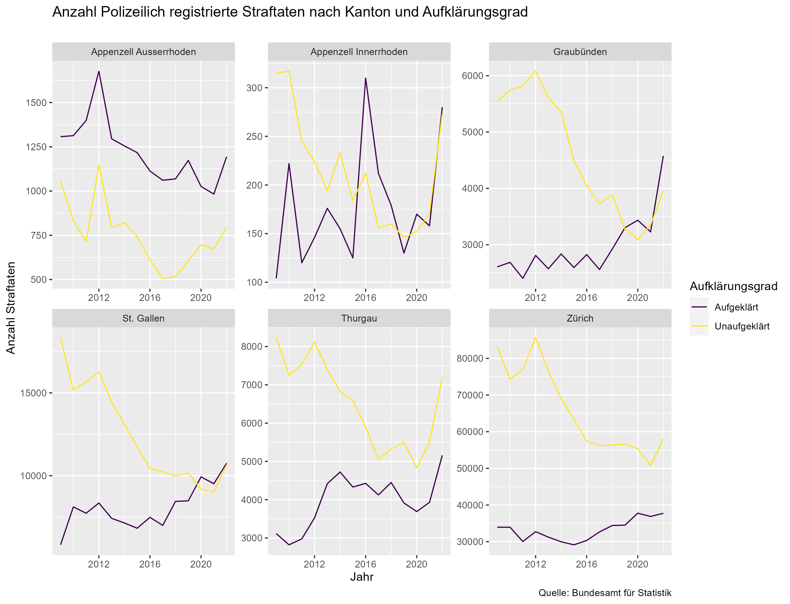
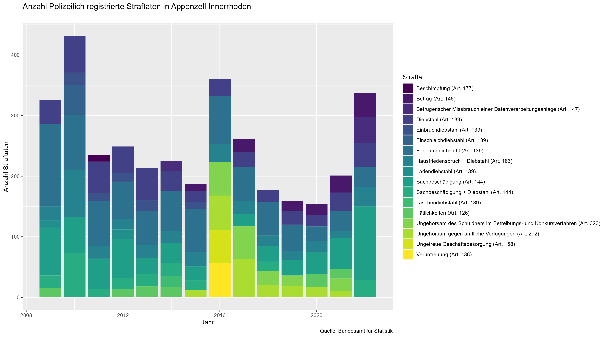

```{r setup, include=FALSE}
knitr::opts_chunk$set(echo = TRUE)
```

## Introduction
***

### Accessing Data from opendata.swiss

The opendata.swiss portal is a joint project of the Confederation, cantons, communes and other organizations with a mandate from the state. It makes open government data available to the general public in a central catalogue. opendata.swiss is operated by the Federal Statistical Office.

Since I would like to publish data for the Canton of Appenzell Innerrhoden on opendata.swiss in the future, I wanted to work with existing data from the portal first.

After exploring the site, I found a dataset from the Federal Statistical Office that caught my attention. It is about [offences registered by the police](https://opendata.swiss/de/dataset/polizeilich-registrierte-straftaten-gemass-strafgesetzbuch-nach-kanton-ausfuhrungsgrad-und-aufk5). This dataset provided information on offences registered by the police according to the penal code, broken down by canton, degree of execution, and degree of clarification. The dataset covered a period from 1 January 2009 to 31 December 2022, making it a comprehensive and valuable source of information.

When I first started working with the dataset, I was surprised to find that the JSON file contained no actual data. However, after further investigation, I discovered that the JSON file was only intended to describe the structure of the HTML, rather than containing any data itself.

To access the data, I had to download it from an [interactive table](https://www.pxweb.bfs.admin.ch/pxweb/de/px-x-1903020100_101/px-x-1903020100_101/px-x-1903020100_101.px/) available on the portal. I initially downloaded it in JSON format, but later also obtained a CSV version.


### Struggles

Getting the data from the JSON into a suitable form was very difficult and I eventually failed. On the one hand, the time series was not complete, as certain offences were not always shown separately. These missing data were marked with an * (asterisk) and not NA.

Furthermore, I was not able to access the deeply ramified information in a proper form and to prepare it efficiently for further processing.

```{r dataset, include = FALSE, echo=FALSE }
# load libraries
library(tidyverse)
library(data.table)

# load data
df <- fread(here::here("data", "px-x-1903020100_101_20230427-102332.csv"), header = TRUE)

# make data tidy
df_strft <- df %>% 
  mutate(`2021` = as.character(`2021`)) %>%
  mutate(`2022` = as.character(`2022`)) %>%
  pivot_longer(cols = c(`2009`, `2010`, `2011`, `2012`, `2013`, `2014`,`2015`, 
                        `2016`,`2017`, `2018`, `2019`, `2020`, `2021`, `2022`),
               names_to = "Jahr",
               values_to = "Value") %>%
  mutate(Value = as.numeric(Value)) %>% # change to numeric
  mutate(Jahr = as.numeric(Jahr)) # change to numeric
```

## Method
***
I approached ChatGPT, a language model trained by OpenAI, for help with my data analysis in R. I had a list of data on criminal offenses in different regions and years, and I wanted to turn it into a dataframe.

ChatGPT tried walking me through the steps of extracting the relevant information from the list and creating a dataframe from it. I encountered a few errors along the way, ChatGPT helped me troubleshoot them and figure out how to fix some of them.

In the end, I was not able to create a dataframe with the data from my list. But I learned a lot about how to work with lists and dataframes in R.

## Results
***

### Development Number of Offences

First I took a closer look at a few cantons in eastern Switzerland. I am interested in how the number of unsolved and solved cases has developed over the years. Has this developed similarly in the different cantons?
Here are the number of offences registered by the police according to canton and degree of clarification:



My next question was about which crimes are most frequently committed in Appenzell Innerrhoden.



The year 2022 was a very intensive year for the Cantonal Police of Appenzell Innerrhoden with a total of 624 registered offences. Around 53% more offences were recorded than in the previous year (409). A higher value of registered offences has only been recorded once since the recording according to uniform specifications of the Federal Statistical Office in 2010. In addition, there were 18 offences against the Narcotics Act (BetmG) (+29%) and 15 offences against the Aliens Act (AIG) (+200%). The offences against other federal secondary laws amount to 38 offences (-38%).
In general, there were no conspicuous changes in the areas of the Narcotics Act, the Aliens Act and the other subsidiary federal laws.

### Violent offences

In 2022, a total of 59 cases were registered in the offence category of violent crimes. This corresponds to an increase of 18%. In the case of serious violent offences, which include homicide, grievous bodily harm, rape and qualified robbery offences, a very low figure of 1 offence was recorded in 2022. Applied minor violence, which includes simple bodily harm, assault, roughhousing, assault, robbery, coercion, violence and threats against authorities and officials, etc., has slightly increased by 9% to a total of 35 offences in 2022. Minor violence (threats and extortion) experienced a sharp increase of 64% to a total of 23 offences.

### Domestic violence

In the area of domestic violence, an increase of 46% to 38 offences can be noted. In the canton of Appenzell Innerrhoden, an average of one case of domestic violence occurred every one and a half weeks in 2022.

## Discussion
***
During this course, I have learned a great deal about data analysis and programming in R. I spent a lot of time working on the class exercises and the capstone project, which challenged me to apply my new knowledge to real-world problems. While I ultimately did not succeed in completing the capstone project as intended, I did gain a deeper understanding of the concepts and techniques covered in the course, which I believe will serve me well in future data analysis projects.

Although I struggled with some of the more advanced topics in the course, such as data wrangling and visualization, I appreciated the comprehensive nature of the lectures and the hands-on approach to learning. I also found the resources provided by the instructors and the online community to be very helpful in working through difficult problems and understanding new concepts.

In terms of the capstone project, I have to admit that I fell short of my goals. I encountered several challenges along the way, including issues with data cleaning and manipulation, as well as difficulties in interpreting the results of my analysis. However, despite these setbacks, I believe that I have made significant progress in improving my skills and understanding of R programming and data analysis. I plan to continue practicing and building on what I have learned in this course, with the goal of eventually becoming proficient in these techniques and applying them in future data analysis projects.

